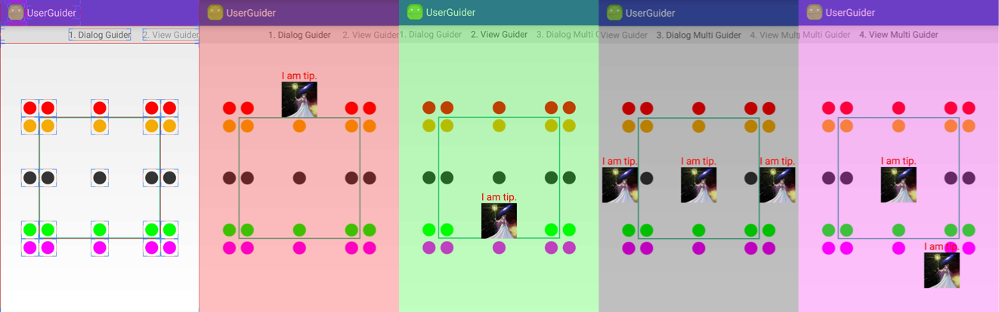

UserGuider
==========

    UserGuider is a tool to introduce user to your newly developed product on you mobile application for android.


Overview
--------

    UserGuider provides four kinds of implementation for the introduction. 
    1. DGuider / VGuider provides a single guide view in the window each time.
    2. DMultiGuider / VMultiGuider can provides multi guide view each time.
    Prefix D implies Dialog implementation, and V for DecorView implementation.
    So choose the one you need or like.

    There are several properties you can provide to customize the introduction.
    1. GuideView / GuideViewId: A view or resource id holding the introduction information.
    1. Anchor: The area you want to put you guide tips around. if not provided, 
       guide tips will be located in the screen center.
    2. Position: The position to locate the guide view relative to anchor. 25 candidates available.
    3. BackgroundColor / DisableAnim / Delay: Properties to customize the window.

```java
            ______________TOP_OUT______________
            |             TOP_IN              |
            |                                 |
            |                                 |
    LEFT_OUT|LEFT_IN      CENTER      RIGHT_IN|RIGHT_OUT
            |                                 |
            |                                 |
            |_____________BOTTOM_IN___________|
                          BOTTOM_OUT
```

Example
-------

The following image shows some demo snapshots. 25 candidates are show in different color for each row.
Click the round dots to trigger Athena appear.




1.DGuider

```java
    new DGuider.Builder()
            .setAnchor(anchor)
            .setBackground(0x7fff0000)
            .setGuideViewId(R.layout.guide_layout)
            .setPosition(DGuider.CENTER | DGuider.TOP_OUT)
            .disableAnim(true)
            .build(getContext())
            .show();
```

2.VGuider

```
    new VGuider.Builder()
            .setAnchor(anchor)
            .setBackground(0x7f00ff00)
            .setGuideViewId(R.layout.guide_layout)
            .setPosition(DGuider.CENTER | DGuider.BOTTOM_IN)
            .disableAnim(true)
            .build(getContext())
            .show();
```

3.DMultiGuider

```java

    DMultiGuider.Builder builder = new DMultiGuider.Builder();
            builder.setAnchor(anchorView).setGuideViewId(R.layout.guider_view_layout)
                    .setBackground(0x7f000000)
                    .setPosition(DGuider.LEFT_OUT| DGuider.CENTER).buildItem();
            builder.setAnchor(anchorView).setGuideViewId(R.layout.guider_view_layout)
                    .setPosition(DGuider.CENTER | DGuider.CENTER).buildItem();
            builder.setAnchor(anchorView).setGuideViewId(R.layout.guider_view_layout)
                    .setPosition(DGuider.RIGHT_OUT | DGuider.CENTER).buildItem();
            builder.build(getContext()).show();
```

4.VMultiGuider

```java
    VMultiGuider.Builder builder = new VMultiGuider.Builder();
            builder.setAnchor(anchorView).setGuideViewId(R.layout.guider_view_layout)
                    .setBackground(0x7fff00ff)
                    .setPosition(DGuider.RIGHT_IN | DGuider.BOTTOM_OUT).buildItem();
            builder.setAnchor(anchorView).setGuideViewId(R.layout.guider_view_layout)
                    .setPosition(DGuider.CENTER | DGuider.CENTER).buildItem();
            builder.build(getContext()).show();
```

License
=======

    Copyright 2016 CodeSky, Inc.

